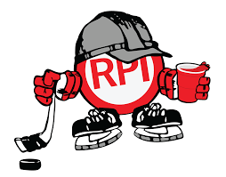

	

<h3 align="center">Puckman Bot</h3>

Discord bot created for the (unofficial) RPI Discord Server

---

## About
Puckman is a community driven bot created for the (unofficial) RPI Discord Server. It has support for:

* Message/Reaction/Quote Leaderboards

* More to come soon™

Read the docs [here](https://moelandblue.github.io/Puckman-Bot/documentation.html)

## Setup
1. [Create a discord bot](https://github.com/reactiflux/discord-irc/wiki/Creating-a-discord-bot-&-getting-a-token)
2. Clone repo
3. Put bot token into `config/tokens.json`
4. Install pip requirements (listed in `requirements.txt`)
    - To get Weather cog working you will need [plotly orca](https://github.com/plotly/orca) installed and on your path
5. Run Puckman.py

## Contributions
Feel like we're missing a feature? Feel free to request it in our [discord](https://www.discord.gg/zN7UPWN) or make a pull request.